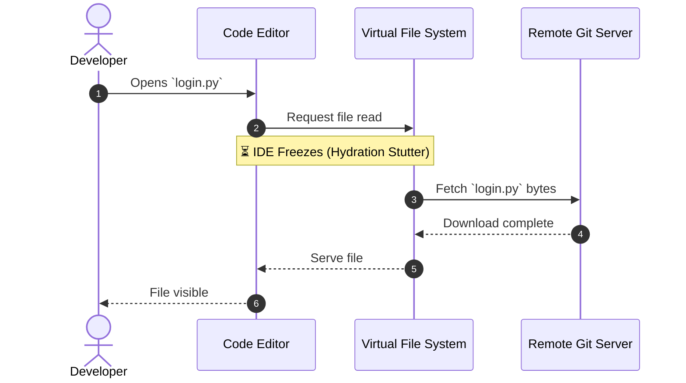
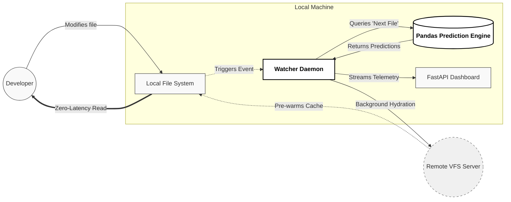

# ⚡ VFS Predictive Prefetcher 
**Zero-Latency File Hydration for Massive Git Monorepos**


Working in a massive enterprise monorepo (like Windows or Office) shouldn't feel like browsing the web on dial-up. 

Virtual File Systems (VFS for Git / Scalar) solve the problem of cloning 50GB+ repositories by creating local placeholders and "lazy-loading" files only when you open them. But this creates a new friction: **Hydration Stutter**. When a developer switches tasks or runs a test suite, the IDE freezes while the network scrambles to download the newly requested files. 

**VFS Predictive Prefetcher** is a background daemon that eliminates this latency. By treating file system access logs as a time-series dataset, this tool predicts which files a developer will need *before* they ask for them, pre-warming the local cache in the background. 

> It is essentially the *Minority Report* for Git.

---

## The Problem: Reactive VFS

In a standard VFS setup, the system is entirely reactive. You ask for a file, you wait for the download, and *then* you can work.



## The Solution: Predictive Hydration

We shift the paradigm from reactive to proactive. By calculating the mathematical probability of developer workflows (e.g., if you touch `login.py`, there is an 85% chance you will need `test_login.py` next), we can fetch the necessary data invisibly.



---

## Architecture & How It Works

This project bridges system-level monitoring with lightweight machine learning. It is divided into four modular micro-components:

1. **The Telemetry Simulator (`generate_mock_data.py`)**
   Since enterprise VFS logs are proprietary, this script generates thousands of realistic developer interactions, simulating co-occurring file opens across different workflows (Auth, UI, Payments).
   
2. **The Analytics Engine (`engine.py`)**
   Powered by **Pandas**, this module ingests chronological file-read events and builds a Markov Chain transition matrix. It provides instant $O(1)$ lookups for the highest-probability "next files."

3. **The Watcher Daemon (`watcher.py`)**
   A low-overhead background process using Python's `watchdog`. It hooks directly into operating system file events. When you modify a file, the daemon queries the Analytics Engine and triggers background VFS hydration without blocking your main thread.

4. **The Live Dashboard (`routes.py` & `main.py`)**
   A **FastAPI** web interface that visualizes the daemon's success rate in real-time, tracking manual file reads versus zero-latency prefetches.

---

## Getting Started

Want to see the predictive magic on your local machine? 

### 1. Installation
Clone the repository and install the required dependencies:
```bash
git clone [https://github.com/adityamittal/vfs-predictive-prefetch.git](https://github.com/adityamittal/vfs-predictive-prefetch.git)
cd vfs-predictive-prefetch
python -m venv venv

# On Mac/Linux:
source venv/bin/activate  
# On Windows:
# venv\Scripts\activate

pip install -r requirements.txt
```

### 2. Generate the Training Data
Create the mock VFS telemetry logs (synthetic data) so the analytical engine has historical data to learn from:
```bash
python generate_mock_data.py
```

### 3. Run the Platform
Boot up the enterprise platform. This starts both the background watcher daemon and the FastAPI dashboard concurrently:
```bash
python -m src.main
```

### 4. Experience the Zero-Latency Magic
1. Open your browser to `http://127.0.0.1:8000` to view the live telemetry dashboard.
2. Open a new terminal tab, navigate to the project root, and trigger a file modification:
   ```bash
   mkdir -p local_repo/src/auth
   echo "Adding an auth check" >> local_repo/src/auth/login.py
   ```
3. Watch the terminal and the dashboard instantly react, predicting and pre-fetching your necessary test files and schemas in the background.

---

## Phase 2: Future Steps
This Phase 1 proof-of-concept proves that file-level predictive prefetching is viable and fast. The roadmap for Phase 2 includes:
* **Deep Git Integration:** Ingesting `git blame` and commit histories to weight the probability matrix.
* **Dead Space Analysis:** Using inverse telemetry to identify and safely evict "stale" files from the local cache, saving gigabytes of local storage.
* **Global Team Models:** Training the engine on entire engineering organizations to optimize dependency fetching during CI/CD pipeline builds.
