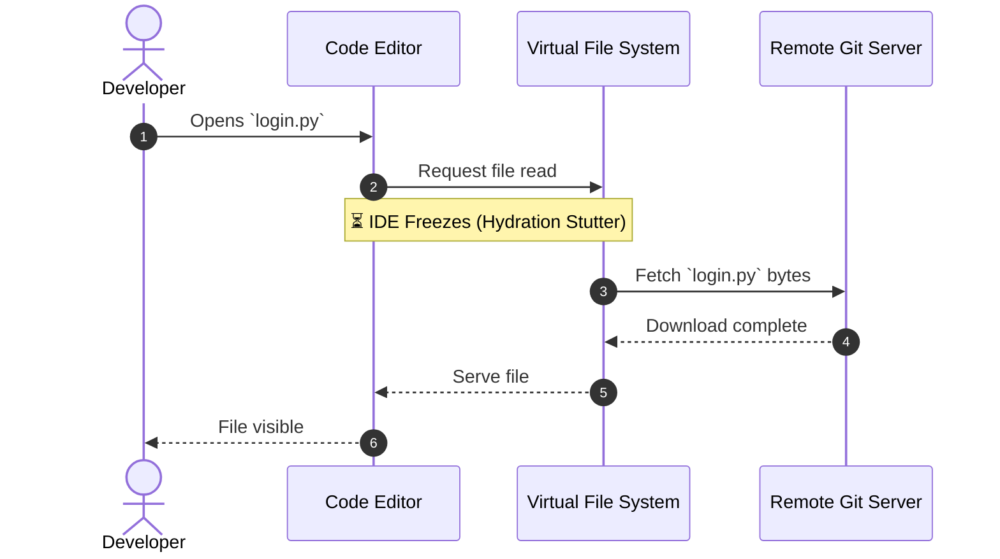
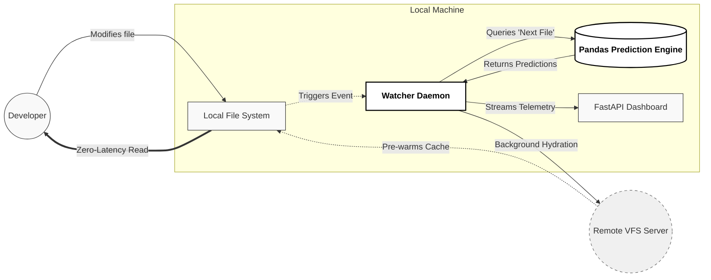

# ⚡ VFS Predictive Prefetcher 
**Zero-Latency File Hydration for Massive Git Monorepos**

Working in a massive enterprise monorepo (like Windows or Office) shouldn't feel like browsing the web on dial-up. 

Virtual File Systems (VFS for Git / Scalar) solve the problem of cloning 50GB+ repositories by creating local placeholders and "lazy-loading" files only when you open them. But this creates a new friction: **Hydration Stutter**. When a developer switches tasks or runs a test suite, the IDE freezes while the network scrambles to download the newly requested files. 

**VFS Predictive Prefetcher** is a background daemon that eliminates this latency. By treating file system access logs as a time-series dataset, this tool predicts which files a developer will need *before* they ask for them, pre-warming the local cache in the background. 

> It is essentially the *Minority Report* for Git.

---

## The Problem: Reactive VFS

In a standard VFS setup, the system is entirely reactive. You ask for a file, you wait for the download, and *then* you can work.

## The Solution: Predictive Hydration

We shift the paradigm from reactive to proactive. By calculating the mathematical probability of developer workflows (e.g., if you touch `login.py`, there is an 85% chance you will need `test_login.py` next), we can fetch the necessary data invisibly.

---

## Architecture &
